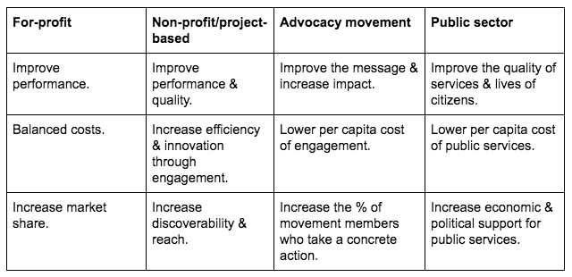

# The Open Leadership Map white paper README

Project lead and contact: [Chad Sansing](mailto:chad@mozillafoundation.org)

## Description

At the Mozilla Foundation, we’ve been asking ourselves questions like these:

- What’s the best way to support leaders in the movement for Internet health?
- What does Open Leadership look like and how does it connect to the principles of openness and working open?
- What might happen if we help ourselves and others become more open by design than open by default?

In pursuit of answers, we’ve begun developing an Open Leadership Map not unlike our Web Literacy Map. 

***We think of Open Leadership as a set of principles, practices, and skills people can use to mobilize their communities to solve shared problems and achieve shared goals.*** The goal of the map is to illustrate how those principles, practices, and skills relate to one another. 

These are the principle of openness that drive development of the map:

- ***Understanding:*** open projects are accessible and clear.
- ***Extensibility:*** open projects are easy to adapt, reproduce, and share.
- ***Participation & inclusion:*** open projects empower contributors; they own the work through accountability, transparency, and shared decision-making.

And these are the practices of Open Leadership that enact those principles. Open leaders:

- ***Design*** projects for contributors and users’ needs and capacities.
- ***Build*** systems and solutions that maximize a project’s clarity, usability, participation, and inclusiveness.
- ***Empower*** contributors to own the work through transparency, accountability, and shared decision-making.

Combining those principles and practices, our map might look something like this:

We’ve included skills drawn from Mozilla’s own experience with working open, literature about organizational evolution and psychology, and research done by Mozilla’s [Open Innovation Strategy Team](https://medium.com/mozilla-open-innovation).

<<<<<<< HEAD
***We would love to know what you think.*** [This white paper](olm-white paper.md) establishes the framework for the project and defines the principles, practices, and skills of Open Leadership. This document is meant to serve as the foundation for whatever form the Open Leadership Map takes and for the curriculum and trainings developed from it.
=======
***We would love to know what you think.*** [This white paper](olm-whitepaper.md) establishes the framework for the project and defines the principles, practices, and skills of Open Leadership. This document is meant to serve as the foundation for whatever form the Open Leadership Map takes and for the curriculum and trainings developed from it.
>>>>>>> origin/master

We would love to know:

- What works for you? What makes the most sense or seems most clear?
- What doesn’t work for you? What seems confusing or in conflict with your understanding of openness?
- What’s missing?

If you have the time and passion to contribute to this project, you can offer feedback on GitHub, on Google Docs, or by email. We estimate that it takes 1-2 hours to review the white paper.

***Our public alpha will run from January 4th, through January 31st, 2018.*** During that time, the Open Leadership Team at the Mozilla Foundation will meet weekly to discuss comments, prioritize pieces of feedback, and revise the document. We will prioritize feedback that helps us make this document as accessible as possible to people wondering how they might begin an open project or begin the process of moving a project or organization from open to closed.

We know that open leaders work to empower others to become open leaders, as well, and we supremely appreciate your leadership in moving this work ahead. 

*Please help us spread this call to action by sharing this post on social media with the hashtag #WOLO, for “work open, lead open.”*

## What Kinds of Skills Do I Need to Contribute?

You don't need any special technical skills to contribute to this project. We will work with you to find a way to gather your feedback on this public alpha of the Open Leadership Map white paper. There are many ways to contrbiute regardless of your experience level with GitHub or working open.

## Are You New to Open Leadership or Working Open?

This blog post, ["How to Work Open"](https://openmatt.org/2011/04/06/how-to-work-open/), by Matt Thompson, is an excellent primer.

## How To Contribute

You can contribute to this white paper in any way that makes sense to you.

***If you have a lot of experience with GitHub and working open,*** you might clone or fork the paper, send us pull requests to incorporate suggested edits, and/or even create a new version of the paper for your own use.

***If you have some experience with GitHub and working open,*** you might share your feedback with us using the Issue Tracker feature as explained below.

***If you have little experience with GitHub and working open,*** you might send your questions and feedback to [Chad](mailto:chad@mozillafoundation.org), the contact person for this project.

## How To File an Issue on GitHub

GitHub can be challenging for new users. If you experience difficulty with it, you are not alone. We want to help you overcome those challenges or find a way to contribute that works for you.

For this project, we can use a feature called the "Issue Tracker" in GitHub to communicate with one another. It's kind of like a shared message board combined with a to-do list. To address an issue to a specific person, you add their name to the issue the same way you would to a tweet, like this for example: @chadsansing would address your message to Chad, the contact person for this project.

If the Issue Tracker is too difficult to use, contact Chad. He will work with you and help you find a way to contribute no matter what.

Here are some steps you can take to get started on GitHub if you'd like to try it.

1. First, create an account on [GitHub](https://github.com).

2. Then visit [our repo](https://github.com/mozilla/olm-white paper) to contribute to the white paper.

3. Next, click on the "Issues" tab near the top of the page.

4. Finally, click on the green "New Issue" button to the left of the page. You can then title your issue and add content. Specificity helps.

Before you submit your issue, label it. You can choose one from the "Labels" dropdown menu to the right of your issue.

We have labels that will let you suggest:

- *Case studies.* Help us curate stories that illustrate the best of Open Leadership and Working Open.
- *Challenges.* Let us know when we get something wrong and suggest a way to fix it.
- *Copy edits.* Help us find the mistakes and typos we've missed.
- *Questions.* Let us know what you wonder about as you review the white paper.
- *Other types of issues.* Feel free to share whatever is on your mind regarding the work.

If you'd like to learn even more about GitHub, check out the [*GitHub for Collaboration* section](https://mozilla.github.io/open-leadership-training-series/articles/github-for-collaboration/) of Mozilla's [Open Leadership Training Series](https://mozilla.github.io/open-leadership-training-series/articles/github-for-collaboration/).

## What's next?

As noted above, ***our public alpha will run from January 4th, through January 31st, 2018.*** During that time, the Open Leadership Team at the Mozilla Foundation will meet weekly to discuss comments, prioritize pieces of feedback, and revise the document. We will prioritize feedback that helps us make this document as accessible as possible to people wondering how they might begin an open project or begin the process of moving a project or organization from open to closed. 

We will share an updated draft of this paper in February, 2018.
