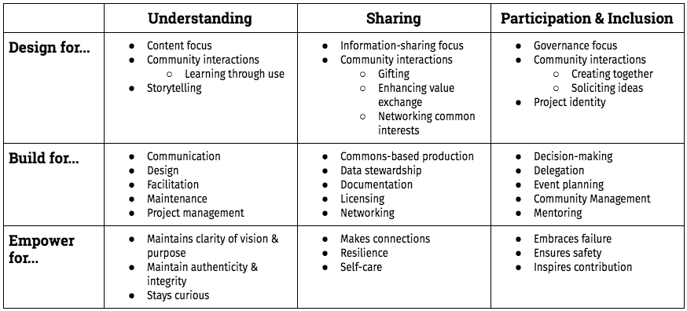

# The Open Leadership Framework README

Project lead and contact: [Chad Sansing](mailto:chad@mozillafoundation.org)

**Note:** We are busy updating our Open Leadership Map white paper language into the Open Leadership Framework. Please excuse us as we make incremental changes in the open. We will have an "official" launch later in H1, 2018, once our edits and new content are set.  

## Background

What is open leadership? What makes it different from leadership, alone? How can we help make it a renewable resource that inspires virtuous loops of community participation and contribution to problem-solving worldwide? How can we help open leaders make their efforts to promote Internet health 
as inclusive, inviting, and empowering as possible?

In pursuit of answers to questions like those, we’ve been developing an Open Leadership Framework. The aim of the framework is to establish an adaptable set of open leadership principles, practices, and skills that people can use for personal and professional development as part of an open community or project. More practical resources built from this framework -  like guides, curriculum, programming, and events - will come later. 

At Mozilla, we’re passionate about working open. This framework is our latest entry into ongoing conversations about what it means to work and lead open in today’s world.

We believe that open leaders design, build, and empower for understanding, sharing, and participation and inclusion.

In the short-term, we hope the framework contributes to conversations about how to work open and enact the principles, practices, and skills of open leadership. In the long-term, we hope the map helps increase public demand for an open Web and society through projects and products that fulfill users’ needs for agency, authenticity, and ownership.

This framework is the first step of a larger, on-going project to develop curriculum, events, trainings, and online resouces like an open leadership map that will help people locate themselves and then move ahead in their open leadership journeys.

## Get involved!

You can visit the framework to check it out for yourself and think about how it relates to your understanding and practice of open leadership.

You should feel free to adapt, criticize, question, remix, and repurpose the framework for your own work. It’s a living document and pushback is welcome and necessary to improve it.

You can also review these personas and use-cases to see how the framework might apply to your work, projects, and communities.

If you’d like to discuss the framework further, you can send questions and suggestions directly to project lead [Chad Sansing](mailto:chad@mozillafoundation.org).

Finally, if you’d like to see examples of the Open Leadership Framework at work across Mozilla’s network and the movement for Internet Health, check out these opportunities to get involved with open leadership programming:

- [Fellowships](https://foundation.mozilla.org/opportunity/fellowships/)
- [Global Sprint](https://mozilla.github.io/global-sprint/)
- [Internet Health Report](https://internethealthreport.org/)
- [MozFest](https://mozillafestival.org/)
- [Open Leaders](https://mozilla.github.io/leadership-training/)
- [Open Leadership 101](https://mozilla.teachable.com/p/open-leadership-101)
- [Open Leadership Training Series](https://mzl.la/open-leadership)

## Office hours

We will hold office hours to collect feedback informally on a drop-in basis.

During April, 2018, we'll share and walk-through 1 use-case per call.

***New etherpad for April, 2018:*** The [office hours notes are here](https://public.etherpad-mozilla.org/p/olf-office-hours).

Here is the schedule for March office hours:

- 4/3/18, 12 PM - 2 PM ET, 16:00 - 18:00 UTC - [OLF self-assessment](https://github.com/mozilla/open-leadership-framework/blob/master/use-cases/olf-self-assessment.pdf)
- 4/12/18, 8 AM - 10 AM ET, 12:00 - 14:00 UTC - [OLF project design assessment](https://github.com/mozilla/open-leadership-framework/blob/master/use-cases/olf-project-design-assessment.pdf)
- 4/18/18, 2 PM - 4 PM ET, 16:00 - 20:00 UTC - [OLF project post-mortem](https://github.com/mozilla/open-leadership-framework/blob/master/use-cases/olf-project-post-mortem.pdf)

## Community calls

We will hold two community calls at the end of March to ask what's working, what's not working, and what's missing from the map.

***New etherpad for April, 2018:*** The [community call notes are here](https://public.etherpad-mozilla.org/p/olf-community-call).

Here is the schedule for March community calls:

- 4/26/18, 8 AM - 9 AM ET, 12:00 - 13:00 UTC
- 4/26/18, 8 PM - 9 PM ET, 00:00 - 01:00 UTC

## What kinds of skills do I need to contribute?

You don't need any special technical skills to contribute to this project. We will work with you to find a way to gather your feedback on this public alpha of the Open Leadership Framework. There are many ways to contrbiute regardless of your experience level with GitHub or working open.

## Are you new to open leadership or working open?

This blog post, ["How to Work Open"](https://openmatt.org/2011/04/06/how-to-work-open/), by Matt Thompson, is an excellent primer.

## How to contribute

You can contribute to this white paper in any way that makes sense to you.

You can follow this series of [weeknotes](https://medium.com/@chadsansing/open-leadership-map-weeknote-1-4f0c4b1b7798), or weekly updates about the project.

You can [stress test prototype use cases](https://medium.com/@chadsansing/testing-open-leadership-map-use-cases-dd8f41ccc8b0) built from the map's framework for personal and professional growth.

Everyone is welcome to join the OLM office hours and community calls.

***If you have a lot of experience with GitHub and working open,*** you might clone or fork the paper, send us pull requests to incorporate suggested edits, and/or even create a new version of the paper for your own use.

***If you have some experience with GitHub and working open,*** you might share your feedback with us using the Issue Tracker feature as explained below.

***If you have little experience with GitHub and working open,*** you can comment on [this Google Doc](https://docs.google.com/document/d/1CxQeaZW4fckRqmPeHn9SGSnY6f2cJX5bONEJYbhVTk0/edit#heading=h.daj7ikbuxrpq) or send your questions and feedback to curriculum manager [Chad Sansing](mailto:chad@mozillafoundation.org), the contact person for this project.

## How to file an issue on GitHub

GitHub can be challenging for new users. If you experience difficulty with it, you are not alone. We want to help you overcome those challenges or find a way to contribute that works for you.

For this project, we can use a feature called the "Issue Tracker" in GitHub to communicate with one another. It's kind of like a shared message board combined with a to-do list. To address an issue to a specific person, you add their name to the issue the same way you would to a tweet, like this for example: @chadsansing would address your message to Chad, the contact person for this project.

If the Issue Tracker is too difficult to use, contact Chad. He will work with you and help you find a way to contribute no matter what.

Here are some steps you can take to get started on GitHub if you'd like to try it.

1. First, create an account on [GitHub](https://github.com).

2. Then visit [our repo](https://github.com/mozilla/open-leadership-framework) to contribute to the white paper.

3. Next, click on the "Issues" tab near the top of the page.

4. Finally, click on the green "New Issue" button to the left of the page. You can then title your issue and add content. Specificity helps.

Before you submit your issue, label it. You can choose one from the "Labels" dropdown menu to the right of your issue.

We have labels that will let you suggest:

- *Case studies.* Help us curate stories that illustrate the best of Open Leadership and Working Open.
- *Challenges.* Let us know when we get something wrong and suggest a way to fix it.
- *Copy edits.* Help us find the mistakes and typos we've missed.
- *Questions.* Let us know what you wonder about as you review the white paper.
- *Other types of issues.* Feel free to share whatever is on your mind regarding the work.

If you'd like to learn even more about GitHub, check out the [*GitHub for Collaboration* section](https://mozilla.github.io/open-leadership-training-series/articles/github-for-collaboration/) of Mozilla's [Open Leadership Training Series](https://mozilla.github.io/open-leadership-training-series/articles/github-for-collaboration/).

## What's next?

Look for our "official" relase of the Open Leadership Framework later in H1, 2018.

## Thank you! 

We are so grateful for your time, attention, and leadership! Let us know how we might best move forward together.
